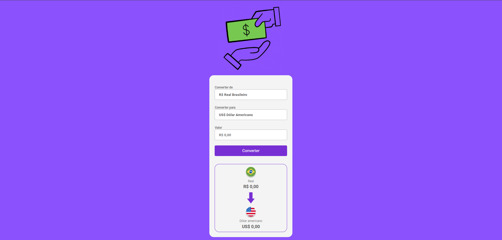

<h1 align="center">CONVERTY MONEY</h1>

Projeto feito para converter a moeda brasileira (R$) em dolar,libra,bitcoin e euro, coloquei em pratica os meus conhhecimentos em functions, if else !!!   

<h3>PROJETO REALIZADO COM AS FERRAMENTAS:</h3>

 
  
  
 
 

 

<h3>Link do projeto</h3>
<a href="https://convertymoney-kaiokaled.netlify.app/">ConvertyMoney.com</a>
